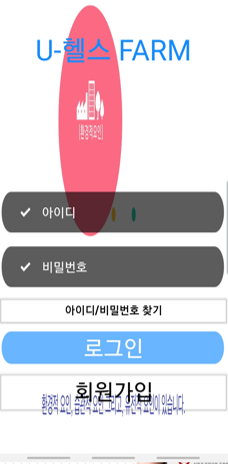
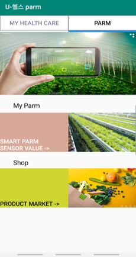
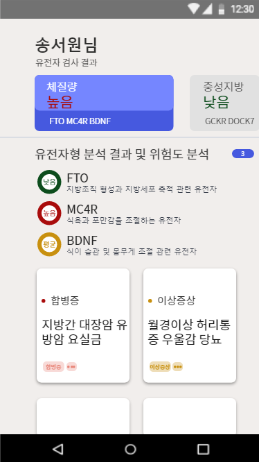
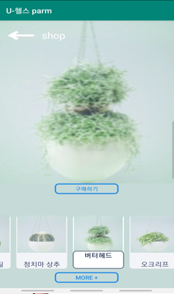
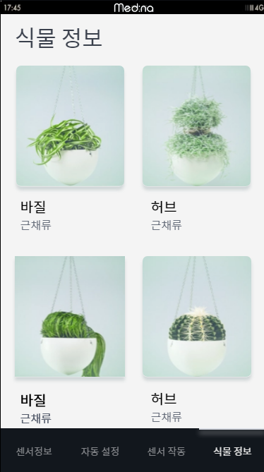
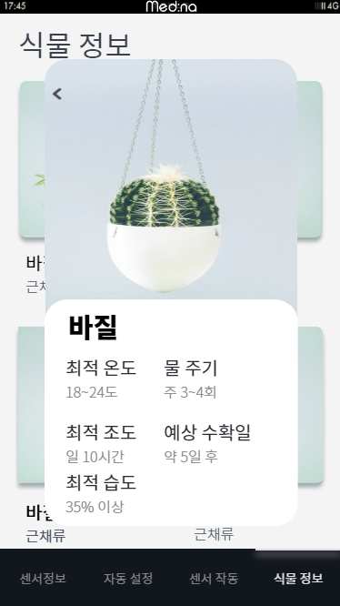
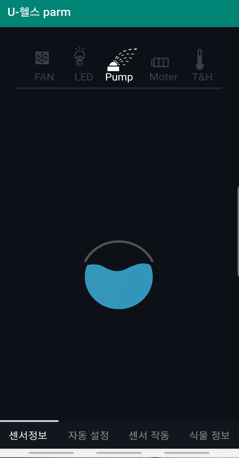
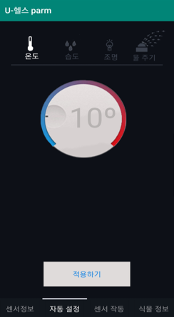

</img> 

# APP을 이용한 센서 조작과 DNA 열람 및 추천 어플

개인의 DNA정보를 열람하고 개인 맞춤 식품 & 식물을 추천받고 라즈베리파이와 연동하여 소켓통신으로 미니팜 센서 값을 변경하고 컨트롤

***

# 개발환경 

* 안드로이드 스튜디오

* java

* jsp

* mysql

***

# jsp서버 코드

[jsp코드](https://github.com/2jooho/public_medi_dna_app/tree/server,"jsp")

***

# 기능 소개

### `1. 로그인, 메인페이지 (유전자 정보열람 페이지와 라즈베리파이 센서 조작 페이지)`   

 

### `2. gene 정보 및 추천 식풀 페이지`   

 

### `3. 라즈베리파이(스마트팜) 센서 조작 페이지`   

 

***

# 코드 소개 

* login.java   

배경으로 영상을 반복재생 시키고 jsp와 비동기 접근

* MainActivity.java   

aFragment, bFragment,autoScrollAdapter를 이용하여 2개의 메인 페이지 구축

* gene_result

해당 유저의 유전자 결과를 db에서 불러와 나타냄 (dna_information.java에서 컨트롤)

* gene_button   

gene버튼 별 수치값 db에서 불러와 나타냄 (dna_information.java에서 컨트롤)

* market_button   

제품 fragment부분 market.java에서 불러옴

* sensor_subbutton   

센서 페이지 안의 또다른 fragment부분과 비동기를 통한 소켓통신
